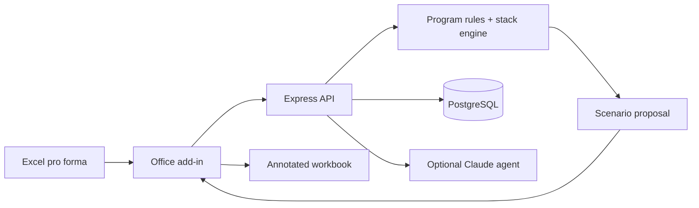

<p align="center">
  <a href="https://github.com/wusterbuilds/incenta/actions/workflows/ci.yml"></a>
  <a href="LICENSE"></a>
  <a href="CONTRIBUTING.md"></a>
</p>

# Incenta

Incenta is an open-source Excel add-in for discovering, comparing, and modeling economic-development incentives directly in a real-estate pro forma.

It turns a fragmented research process into a reviewable workflow: qualify programs, expose tradeoffs, test compatible stacks, write a scenario into Excel, and retain a cell-level audit trail.

> **Project status:** functional prototype with a synthetic Denver demonstration dataset. Program rules are illustrative and must be verified with the relevant agency and professional advisers.

## What it demonstrates

- One-click incentive audits from workbook assumptions.
- Qualified, near-miss, and not-applicable program tiers.
- Tradeoff calculations for affordability, wage, timing, and compliance constraints.
- Compatible incentive stacks and before/after return comparisons.
- Reversible spreadsheet updates with annotations and change summaries.
- Optional Claude-powered exploration with deterministic mock responses as a fallback.

## Try the demo

Prerequisites: Node.js 18+, Docker, Python 3 with `openpyxl`, and Excel desktop or web.

Create the synthetic workbook:

```bash
python create_source_proforma.py
```

Start the database and API:

```bash
docker compose up -d
cd server
npm ci
npx prisma migrate dev
npx tsx prisma/seed.ts
npm run dev
```

Start and sideload the Excel add-in in another terminal:

```bash
cd addin
npm ci
npm run dev
npx office-addin-debugging start manifest.xml
```

Open `sample_external_proforma.xlsx`, launch Incenta from the Excel ribbon, and select **Run Incentive Audit**.

## Architecture



| Path | Purpose |
| --- | --- |
| [`addin`](addin) | React, TypeScript, Office.js, audit UI, and cell annotations |
| [`server`](server) | Express API, Prisma schema, program matching, and scenario planning |
| [`create_source_proforma.py`](create_source_proforma.py) | Generates the fully synthetic demo workbook |

## Important boundaries

- Included program and market records are demo data, not a current incentives database.
- Do not use generated eligibility conclusions without validating source statutes and agency guidance.
- Work on a copy of any workbook until you have reviewed the proposed changes.
- This software does not provide tax, legal, accounting, investment, or compliance advice.

## Development

```bash
cd server && npm run build
cd ../addin && npm run build
```

See [CONTRIBUTING.md](CONTRIBUTING.md) and [SECURITY.md](SECURITY.md).

## License

MIT. See [LICENSE](LICENSE).
